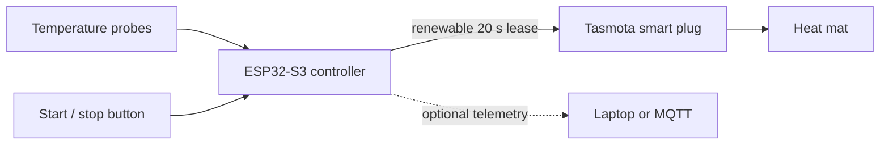

# Tempeh OS

An autonomous, low-cost tempeh incubator controller built around an
ESP32-S3, temperature probes and a fail-safe Tasmota smart plug. It is for
people who want to make tempeh with a small, locally controlled incubator and
are comfortable with low-voltage wiring and a terminal.

## What it does

The ESP32 reads incubator temperature, decides when heat is needed and renews a
short lease on the Tasmota plug. An optional product probe adds a second
temperature cutoff. If the ESP32, Wi-Fi, box-air probe or control loop fails,
the plug stops heating when the lease expires. A laptop is not required during
incubation.



The controller targets **30 °C** box air and cuts off heat at **34 °C** box
air. An enabled product probe also cuts off at 34 °C. Starting always requires a
deliberate two-second button hold.

## Choose your route

The current hands-on build uses the **Nologo ESP32-S3 SuperMini** that made the
recorded successful batch. It is the route to use when reproducing the current
project. Do not assume that every board sold as a “SuperMini” is equivalent.

Start with the **[build and first-batch guide](docs/getting-started.md)** for
parts, wiring, installation and practical first-build checks.

For an existing, tested incubator, use the **[operating and troubleshooting
guide](docs/operating.md)** for each batch, normal stopping and faults.

For simulations, serial diagnostics and engineering experiments, use the
**[development guide](docs/development.md)**.

## Current controller wiring

The current SuperMini build needs one DS18B20 probe:

- `box_air` on GPIO13 controls normal heating;
- optional `product` on GPIO4 provides an independent product-temperature
  safety limit.

An optional third `room_air` probe on GPIO6 records ambient temperature but
does not control the heater.

The ESP32-S3-DevKitC-1 remains the longer-term reference target because it is
more consistently identifiable. It has not yet been tested in this project. Its
addressable LED is on GPIO48 on the original board and GPIO38 on revision 1.1,
while current firmware assumes GPIO48; adapt the pin and run the controller
smoke check before using it.

See also:

- [reference hardware and original Spanish purchase record](docs/hardware/bom.md);
- [current validation status](docs/validation.md);
- [prototype safety notes](docs/hardware/safety.md).

## Current status

| Milestone | Status |
| --- | --- |
| Automated software checks | Passing locally; CI workflow configured |
| Autonomous no-load safety check on ESP32-S3 SuperMini | Passed 9 September 2026 |
| Empty-box warm-up and successful tempeh batch | Completed |
| ESP32-S3-DevKitC-1 smoke check | Not yet run |

The [first-build checks](docs/validation.md) explain the small set of checks worth
repeating after relevant changes.

## Optional monitoring

The ESP32 controls heating locally. A connected laptop can display its serial
telemetry without taking over control:

```bash
cargo run -p tempeh-host -- ports
cargo run -p tempeh-host -- monitor /dev/cu.usbmodem1234561
```

Open <http://127.0.0.1:8787>. Generic read-only MQTT telemetry is also
available through [MQTT Explorer](docs/mqtt-explorer.md); Home Assistant is an
optional separate integration. A laptop only observes the controller. It does
not participate in the heating safety path.

The dashboard shows controller faults, reading ages and heat requested separately
from the last Tasmota plug confirmation. It also saves a complete serial log for
troubleshooting. See [monitoring and serial evidence](docs/development.md#monitor-faults-and-keep-serial-evidence)
for confirmation limits, log files and replay instructions.

Monitoring is optional and must never be treated as part of the heater safety
path.

## Development

Simulation, firmware build details and repository structure are documented in
[the development guide](docs/development.md). The host tools do not actuate the
plug; the ESP32 is the only supported heater controller.

```bash
cargo test
```
