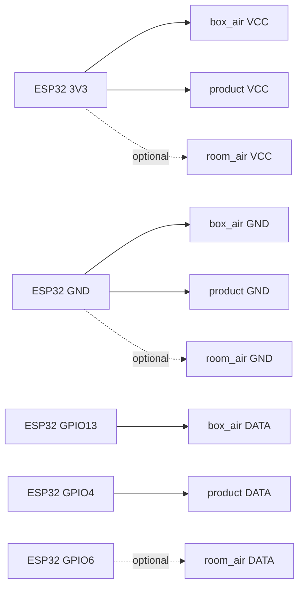

# Build and Use Tempeh OS

This is the canonical path for reproducing the current autonomous Tempeh OS
incubator. Follow the stages in order. Do not skip directly to a food batch.

> [!IMPORTANT]
> The working prototype has completed the full validation ladder and made a
> successful tempeh batch. The detailed evidence and photographs still need to
> be added to the repository. The ESP32-S3-DevKitC-1 has not yet been recorded
> as a separate repetition; see the [validation status](validation.md).

## What you are building

The current build uses:

- the Nologo ESP32-S3 SuperMini used in the recorded no-load test;
- one required `box_air` DS18B20 probe on GPIO13;
- one required `product` DS18B20 probe on GPIO4;
- an optional `room_air` DS18B20 probe on GPIO6;
- a Tasmota-compatible EU smart plug;
- a plain 20–30 W seedling heat mat beneath a 40–50 L incubation box;
- a heat spreader and raised rack inside the box;
- thin, perforated food-contact bags for the beans.

The ESP32 controls the plug directly over the local Wi-Fi network. A laptop is
needed to install the current firmware, but not to run the incubator. Other
boards sold as “SuperMini” are not automatically equivalent. The DevKitC-1 is a
longer-term target, not a tested substitute: see the [hardware record](hardware/bom.md).

## Before you begin

You should be comfortable with basic low-voltage jumper wiring and command-line
instructions. Do not open or modify mains-powered equipment. Use a commercially
enclosed, correctly rated Tasmota plug.

Read the [safety notes](hardware/safety.md), then obtain the parts in the
[hardware record](hardware/bom.md). The record identifies known parts and gaps;
it is not yet a complete current shopping basket.

## Prepare your laptop and obtain the repository

The documented host paths are macOS and Ubuntu/Debian Linux. Other Linux
distributions need equivalent packages and serial-permission configuration.

### macOS

Install Xcode Command Line Tools, [Rust](https://rustup.rs/) and Homebrew. Then
install build and USB prerequisites:

```bash
xcode-select --install
brew install cmake ninja dfu-util pkg-config
```

### Ubuntu or Debian

Install Rust, Python 3 and the native packages needed by the Espressif toolchain
and serial utilities:

```bash
sudo apt update
sudo apt install build-essential cmake ninja-build pkg-config libssl-dev libudev-dev python3
curl --proto '=https' --tlsv1.2 -sSf https://sh.rustup.rs | sh
```

To access serial devices without `sudo`, add yourself to `dialout`, then sign out
and back in:

```bash
sudo usermod -a -G dialout "$USER"
```

Clone the repository and enter it:

```bash
git clone https://github.com/jokroese/tempeh-os.git
cd tempeh-os
```

**Checkpoint:** `cargo --version` works and you are at the repository root. If
Rust or a package installation fails, resolve that before wiring or flashing.

## Stage 1: configure the Tasmota plug

Use a plug supplied with Tasmota already installed. Do not open a mains plug to
flash it as part of this project.

1. Power the plug according to its manufacturer's instructions.
2. Connect a phone or computer to the temporary `tasmota_...` Wi-Fi network.
3. Open <http://192.168.4.1> if the configuration page does not appear.
4. Connect the plug to the same local Wi-Fi network that the ESP32 will use.
5. Find the plug's local address in the Tasmota page or your router.
6. Open that address in a browser and confirm that the relay can be turned off.
7. Reserve the address in your router so it does not unexpectedly change.

The official [Tasmota getting-started guide](https://tasmota.github.io/docs/Getting-Started/)
has detailed Wi-Fi and recovery instructions. Keep the plug on the local network;
do not expose its web interface to the internet.

**Checkpoint:** you know the stable local address, such as
`http://192.168.1.50`, and the relay is off.

## Stage 2: assemble the low-voltage controller

Disconnect the heat mat from the smart plug while assembling and flashing.

### Reference wiring



For the probe adapter modules used in the prototype:

| Probe wire | Adapter / ESP32 role |
| --- | --- |
| Red | VCC / 3V3 |
| Black | GND |
| Yellow | DATA |

Wire colours are not a universal guarantee. Check the documentation supplied
with each probe before applying power. The prototype adapter modules include the
required pull-up; a bare DS18B20 normally needs a pull-up resistor.

Label the two required probes physically before continuing:

- **BOX AIR — GPIO13**
- **PRODUCT — GPIO4**

**Checkpoint:** the low-voltage wiring matches the table, no bare conductors can
short, and the heat mat remains disconnected.

## Stage 3: arrange the incubator

From bottom to top:

1. Place the heat mat outside and beneath the plastic box.
2. Put a thin aluminium or stainless-steel tray, or a ceramic tile, inside the
   bottom of the box as a heat spreader.
3. Put a raised food-safe rack above the spreader.
4. Place the perforated tempeh bags on the rack only after all non-food tests
   pass.

Position `box_air` in free air at food height without touching the rack, box or
bag. Position `product` against the outside of a representative bag unless the
probe is explicitly rated for food contact. Use the dummy-load test to
characterise how closely this placement follows the centre of the mass. Route
cables without creating a large lid gap; leave the small ventilation gap
required by the batch procedure.

**Checkpoint:** the bags cannot touch the heat spreader and all mains equipment
and cable joins remain outside the humid chamber.

## Stage 4: install and flash the ESP32 firmware

The current firmware must be built locally. Install Rust using
[rustup](https://rustup.rs/), then install the Espressif Rust tools:

```bash
cargo install espup --locked
espup install
cargo install espflash --locked
```

Load the installed ESP environment in the current shell:

```bash
. ~/export-esp.sh
```

From the repository root, create the private device configuration:

```bash
cd crates/tempeh-firmware-esp32
cp firmware.local.example.toml firmware.local.toml
```

Edit `firmware.local.toml` with the Wi-Fi details and the stable Tasmota address:

```toml
[wifi]
ssid = "your-wifi-name"
password = "your-wifi-password"

[tasmota]
base_url = "http://192.168.1.50"

[probes]
box_air = true
room_air = false
product = true
```

The local file contains secrets, is excluded from Git and is compiled into the
firmware. Do not distribute the resulting firmware image.

Connect the SuperMini with a USB **data** cable. From another terminal at the
repository root, identify its serial port:

```bash
cargo run -p tempeh-host -- ports
```

macOS ports often begin with `/dev/cu.usbmodem`; Linux ports are commonly
`/dev/ttyACM0` or `/dev/ttyUSB0`. Return to `crates/tempeh-firmware-esp32` and
flash it, replacing the example port with the detected one:

```bash
ESPFLASH_PORT=/dev/cu.usbmodem1234561 cargo run --release
```

The command keeps a serial monitor open after flashing. On a successful boot,
the plug is explicitly switched off, its fail-safe settings are confirmed and
the LED becomes blue. Look for `state,0,idle,boot_configured`.

**Checkpoint:** serial output includes `state,0,idle,boot_configured`, the LED is
blue and the plug is off.

Press Ctrl-C to close the flashing monitor before opening another serial tool.
This only closes the laptop viewer; it does not stop the ESP32. At this stage
the heat mat must still be disconnected.

## Stage 5: complete the validation ladder

Complete your own [validation checklist](validation.md#builder-checklist). The
order is a safety gate, not a suggestion:

1. no-load firmware check with the heat mat disconnected;
2. side-by-side probe comparison;
3. supervised heated empty-box test;
4. supervised heated dummy-load test;
5. only then, a first food batch.

Stop if a stage fails. Correct the cause and repeat that stage before moving on.
The complete eight-step no-load procedure is in the
[firmware documentation](../crates/tempeh-firmware-esp32/README.md#no-load-acceptance-check).

## Stage 6: prepare the tempeh

Use the Domingo Club
[How to make tempeh](https://domingoclub.com/docs/fermentation/how-to-make-tempeh)
procedure for cleaning, soaking, washing, cooking, drying, acidifying,
inoculating and moulding the beans. That procedure calls for incubation around
30 °C for approximately 36–48 hours and explains the visual development to
expect.

Where their procedure offers several moulds, the Tempeh OS reference build uses
perforated food-contact bags:

- keep the bean layer **15–20 mm** thick;
- space holes approximately **10–15 mm** apart on both sides;
- do not put food directly against the incubator box or heat spreader.

The external procedure remains the authority for preparing the food. Tempeh OS
controls incubation temperature; it does not determine whether food is safe to
eat.

## Stage 7: start and supervise incubation

1. Confirm the LED is blue, both required probes are reporting and the product
   temperature is below the 34 °C cutoff.
2. Put the prepared bags on the rack and position the probes as tested during
   the dummy-load stage.
3. Hold **BOOT** for two seconds.
4. Confirm the LED becomes green.
5. Supervise a new or materially changed setup and inspect the product according
   to the food procedure.

The ESP32 targets 30 °C box air. Fermenting tempeh later generates its own heat,
so product temperature and ventilation remain important even when the heater is
off.

Optional laptop monitoring does not control the heater:

```bash
cargo run -p tempeh-host -- monitor /dev/cu.usbmodem1234561
```

Open <http://127.0.0.1:8787>. Press Ctrl-C when finished viewing; this does not
stop a running controller. Keep the CSV and serial capture if the controller
faults. For Wi-Fi observation without Home Assistant, follow
[Watch your incubator over Wi-Fi](mqtt-explorer.md).

## Stage 8: faults, stopping and finishing

Press **BOOT** once to stop a running controller. Confirm the LED becomes blue
and the Tasmota relay is off before removing the product.

If the LED turns red, use the detailed [fault and power-loss procedure](operating.md#faults-and-power-loss). In short:

1. treat the run as stopped and verify the relay is off;
2. inspect serial or MQTT telemetry to identify the fault;
3. correct the failed probe, excessive temperature, Wi-Fi or plug connection;
4. hold **BOOT** for two seconds to acknowledge the recovered fault;
5. confirm blue idle;
6. use appropriate food-safety guidance to decide whether an interrupted batch
   must be discarded;
7. hold for two seconds again only if deliberately restarting.

The controller does not currently have a finished state or automatic batch
timer. Stop it manually when the external food procedure says the batch is
ready, then follow that procedure for cooling, cooking or storage.

## Development and alternative hardware

The Nologo ESP32-S3 SuperMini is the current hands-on development board.
Alternative boards, probes, enclosures and heaters require their own recorded
acceptance results. See [development.md](development.md) for simulation, serial
protocol and legacy host-control commands.
